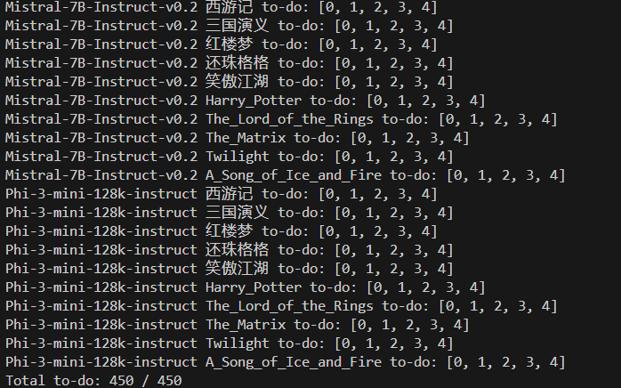

## Generate Script
```python
python script.py

```
You will see



## 2. Launch LLM Service
```
nohup python api.py >log/api.log
```

## 3. Run Simulator.py

Run the commands of corresponding LLM in `run_new_scene.sh`

```bash
nohup python -u simulator.py --character_llm gpt-4 --scene_path data/scene_data/few_shot_scenes/西游记.json --scene_id 0 --config_file config/config_new_scene.yaml --output_file messages.json > log/西游记/wp_few_shot_azure_GPT-4-Turbo_0.log 2>&1 &
```

## 4. Evaluation