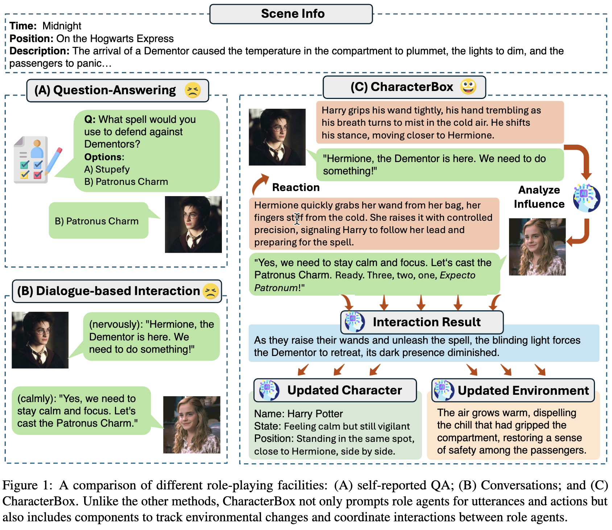

# CharacterBox


<p align="center">
  
</p>


## Installation

To install CharacterBox, one can follow the following steps:


1. Install the required dependencies:

   ```shell
   pip install -r requirements.txt
   ```

## Quick Start

The preprocessed data for 10 scripts used in this paper can be found in the `data` directory.


To run the simulation, execute the following command:

```shell
python -u simulator.py --config_file config/config.yaml --log_file simulation.log
```

`config_file` is the path of the configuration file. Please specify `narrator_llm`, `character_llm`,`scene_path` and `scene_id` in `play.yaml`.
`log_file` set the path of the log file.

In `play.yaml`, configure the `api_key` and `api_base` for both the character and narrator.

CharacterBox uses an OpenAI-compatible API interface. If you're using a local model, you can leverage `api.py` or the [OpenAI-Compatible Server](https://docs.vllm.ai/en/latest/serving/openai_compatible_server.html) provided by vLLM. In this case, set the api_base to the appropriate endpoint, such as: `http://localhost:8000/v1/`.


## Evaluation


Run the evaluation script for a scene:

```shell
python quick_start_eval.py --config_file config/evaluate.yaml --log_file evaluate.log
```
Please specify `title`, `judger_llm`, `narrator_llm`, and `character_llm` in `evaluate.yaml`. The result is saved in `output/evaluation/detail/{title}/{judger}_{narrator}_character_evaluation.csv`.


